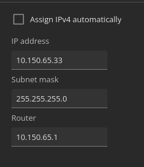

## How to assign an IP to a camera.
The Axis portal sets a standard ip (`192.168.0.90`) if no DHCP-server is available. <br>
If the camera has been used for something else before you have the option to reset it or use Wireshark to capture the IP-adres of the camera. <br><br>

### Step-by-step
1. Open the Axis-portal of the camera in your web-browser of choice. <br>
2. Go to `System -> Network`. <br>
3. Uncheck `Assign IPv4 automatically`<br>
4. Change the IP-settings. <br>


### Example
```
IP: 192.168.65.33
Subnetmask: 255.255.255.0
Gateway: 192.168.65.1
```

