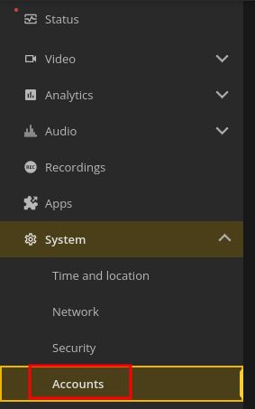
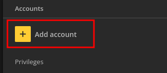
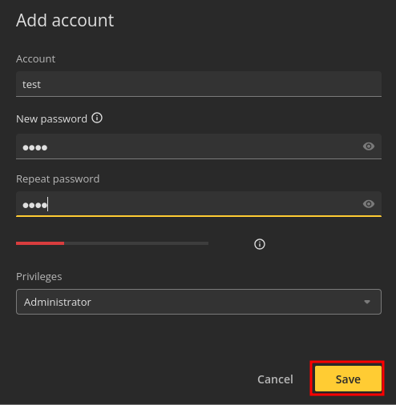

## How to add a new user

### Step-by-step
1. Open the Axis-portal of the camera in your web-browser of choice.  
2. Go to `System -> Accounts`.  
  
3. Click on `Add Account`. 
  
4. Fill in the credentials of the new user and click on `Save`.  
