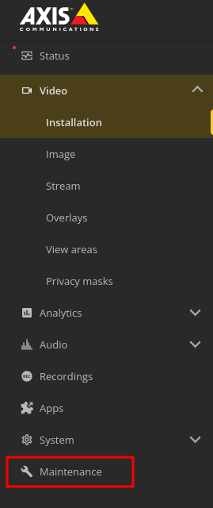
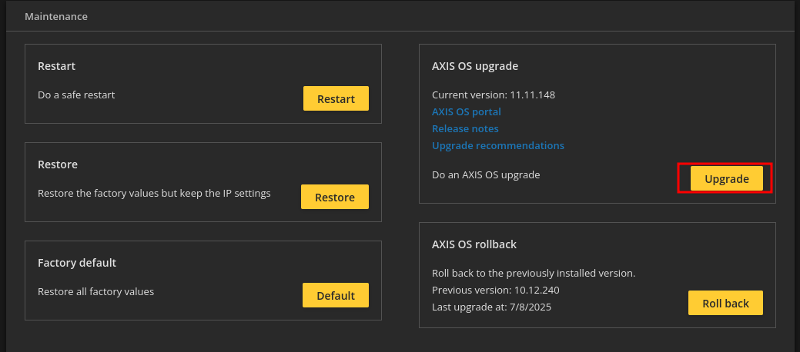
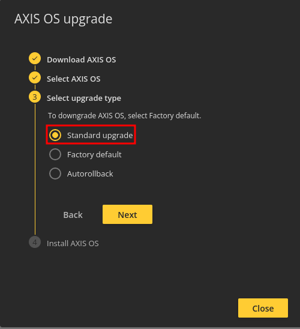

## How to update a camera

### Step-by-step
1. Open the Axis-portal of the camera in your web-browser of choice.  
2. Go to `Maintenance`.  
  
3. Under `Axis OS upgrade` click on `Upgrade`. 
  
4. Download the correct OS version from the Axis website. 
4. Choose the correct downloaded OS version.  
5. Select `Standard upgrade` and click `Next`. 
  
6. Click on `Upgrade`. 

Updating the camera will take some time but the index screen will reload after it is done.